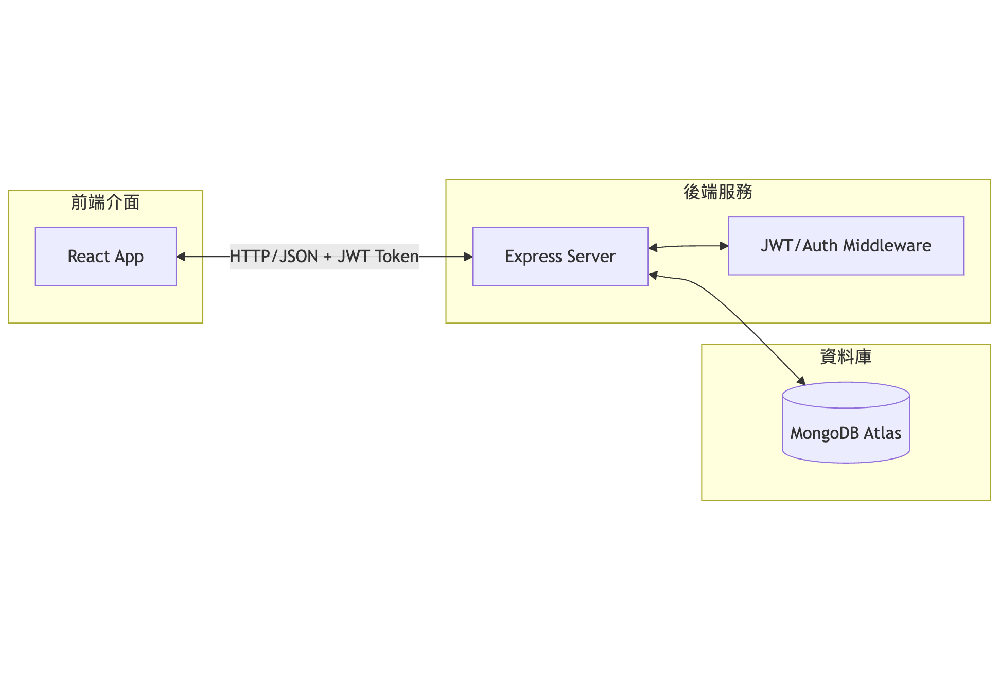
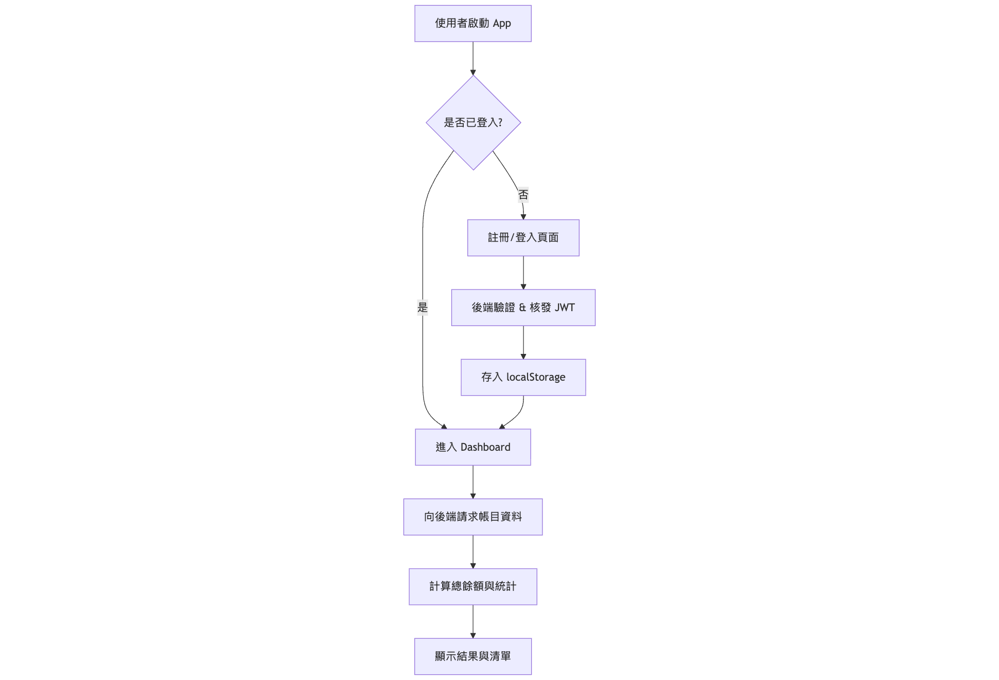

# 114_web_endterm_project
##  CoinKeep - 記帳系統

CoinKeep 是一個基於 MERN Stack 開發的響應式記帳應用程式，旨在幫助使用者輕鬆管理個人財務，並提供直觀的數據統計與視覺化體驗。

## 專案特色
- **安全驗證**：採用 JWT (JSON Web Token) 認證與 Bcrypt 密碼雜湊加密。
- **數據分析**：自動計算本月總收入、總支出與目前資產餘額。
- **智慧排序**：帳目自動按日期分組，並由新到舊排序顯示。
- **響應式設計**：完美支援手機與桌機瀏覽，具備流暢的操作體驗。

## 使用技術
- **Frontend**: React.js, Axios, CSS3 (Flexbox/Grid), Vite
- **Backend**: Node.js, Express.js
- **Database**: MongoDB (Mongoose ODM)
- **Authentication**: JWT, Bcryptjs
  
|維度|實作技術|目標|
| :--- | :--- | :--- |
|資料安全|Bcrypt (Salted Hash)|防止密碼明文外洩|
|身份認證|JWT (Stateless Auth)|安全且高效的 API 存取控管|
|前端架構|Component-Based (React)|提升 UI 複用性與渲染效能|
|後端架構|Middleware Pattern|實現邏輯解耦與安全性檢查|

## 技術核心與設計實踐
### 1. 登入與權限管理 (Auth & Authorization)
- 安全儲存：後端實作 Bcrypt 對使用者密碼進行 Salt 雜湊處理，確保資料庫遭洩漏時密碼依然安全。
- 權限控管：採用 JWT (JSON Web Token) 機制。登入成功後，Token 會存於前端 Local Storage，後續請求皆須通過後端自定義的 verifyToken 中介軟體進行身份驗證。

### 2. 設計模式應用 (Design Patterns)
- Observer Pattern (觀察者模式 - 前端)：
  - 應用場景：全站使用者登入狀態管理。
  - 實現方式：利用 React 的 State (useState) 機制，當 App.jsx 中的 user 狀態變更時，自動驅動 Login、Signup 與 Dashboard 組件進行視圖切換與重新渲染。

- Middleware Pattern (中介軟體模式 - 後端)：
  - 應用場景：API 安全保護。
  - 實現方式：將「JWT 驗證」抽離成獨立的 Middleware，並在 routes 層進行掛載。這實現了職責分離，確保帳目 CRUD 邏輯不會與驗證邏輯耦合。

- Singleton Pattern (單例模式 - 資料庫)：
  - 應用場景：MongoDB 資料庫連線。
  - 實現方式：後端程式碼確保資料庫連線在伺服器啟動時僅被建立一次，並在整個應用生命週期中重複使用該連線實例。
  
---

## 系統開發文件

### 1. 系統架構圖 (System Architecture)
- 展示本專案之 MERN 前後端分離架構與資料庫整合流向。


### 2. 運作流程圖 (System Flowchart)
- 展示使用者從身份驗證到儀表板統計邏輯的完整流程。


---

## API 規格說明

| 方法 | 路徑 | 說明 | 需要驗證 |
| :--- | :--- | :--- | :--- |
| POST | `/api/auth/signup` | 使用者註冊 | 否 |
| POST | `/api/auth/login` | 使用者登入 (核發 Token) | 否 |
| GET | `/api/expenses` | 取得當前使用者所有帳目 | 是 (JWT) |
| POST | `/api/expenses` | 新增一筆帳目紀錄 | 是 (JWT) |
| DELETE | `/api/expenses/:id` | 刪除指定帳目 | 是 (JWT) |

---

## 安裝與執行步驟

### 環境需求
- Node.js v16+
- npm
- MongoDB（可使用 MongoDB Atlas）
  
### 必要環境變數
請在 `backend` 資料夾建立 `.env`（不要把實際密鑰上傳到版本控制）。下方為安全的範例（替換 `<...>` 為實際值）：

```env
# Backend (.env)
MONGO_URI=mongodb+srv://<db_user>:<db_password>@cluster0.mongodb.net/CoinKeep?retryWrites=true&w=majority
JWT_SECRET=your_strong_jwt_secret_here
PORT=5500
# ALLOWED_ORIGIN 設定建議：
# 本地開發：http://localhost:5173
# 正式部署：https://fannno.github.io
ALLOWED_ORIGIN=https://fannno.github.io
```

另外，前端可在 `frontend/.env` 使用 Vite 變數來設定 API 路徑：

```env
# Frontend (.env)
VITE_API_URL=https://coinkeep-backend.onrender.com
```

注意：前端的 `VITE_API_URL` 應指向你的後端 API 網址（開發時可用 `http://localhost:5500`，部署時改為正式網址）。

### 1. 啟動後端 (Backend)
```Bash
cd backend
npm install
# 建立 .env，填入上方範例變數
npm run dev
```
### 2. 啟動前端 (Frontend)
```Bash
cd frontend
npm install
npm run dev
```
- 預設：前端 Vite 通常為 `5173`。如有改動請同步更新 `ALLOWED_ORIGIN` 或前端 API URL 配置。

## 使用指引與演示
1. 註冊與登入：新使用者請先註冊，登入後 Token 將安全存入 localStorage。
2. 記帳操作：在儀表板輸入標題、金額與日期，系統將即時更新總餘額。
3. 數據管理：使用者可隨時刪除錯誤的帳目，系統會重新計算統計數據。

### Demo 影片連結：